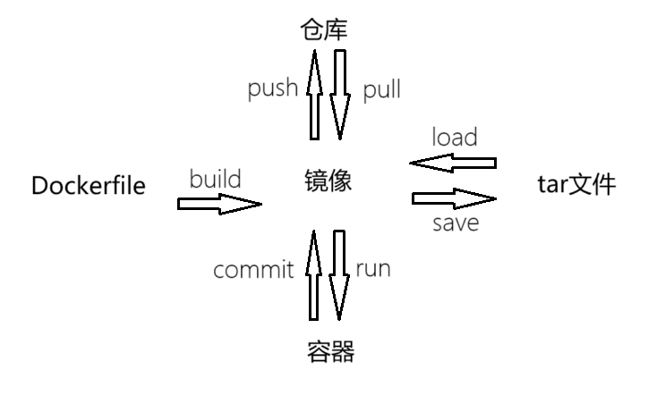

## 什么是docker？

docker是一个虚拟机。但是主要应用中Linux和后台一些应用。

## 基本概念



### 镜像

> 类似于创建虚拟机前，需要下载的iso，img等等镜像文件。

### 容器

> 类别做正在运行中的一个虚拟机

### tar文件 

> 类似于vm使用时的vmdk文件
>
> 可以将一个镜像直接save成一个tar文件，通过load指令，重新加载成一个镜像。

### Dockerfile

> 一个很短的配置文件。通过配置，来指定一个镜像是如何构建的。

### 仓库

> 特别厉害的远程仓库，保存了很多镜像。如：ubuntu、nginx、MySQL、tomacat等等。

## 使用

###  play with online


### 仓库—镜像—容器

```docker
//从仓库下载nginx镜像
//这两行代码是一个作用，都是下载最新的镜像

docker pull nginx
docker pull nginx:latest

//运行服务器
docker run nginx
//指定一些参数 
//-d使其后台运行，不堵塞shell指令窗口
//-p指定内外端口映射
docker run -d -p 80:80 nginx
docker run -d -p 81:80 nginx

//查看已运行的端口
docker ps

//修改端口的id
//bash参数是进入该容器
docker exec -it 端口id bash

//进入该容器后，我们可以修改里面的文件
//访问80端口，出现hello
cd /user/share/nginx/html/
echo hello > index.html //修改文件内容
cat index.html //查看文件内容
ls //退出
exit //退出

//删除端口
docker rm -f 端口id

//提及镜像，指定镜像名字
docker commit 端口id m1
//查看镜像
docker images

docker run -d -p 90:80 nginx

```

### Dockerfile

